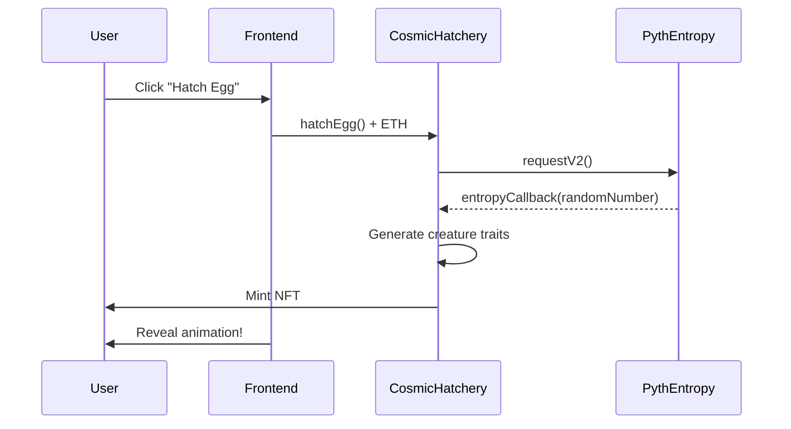

# 🥚 Cosmic Egg Hatchery

An on-chain game where players hatch cosmic eggs containing unique creatures with randomly generated traits, powered by **Pyth Entropy v2** for verifiable randomness on **Base Sepolia**.


## ✨ Features

- **Verifiable Randomness**: Uses Pyth Entropy v2 for provably fair creature generation
- **ERC-721 NFTs**: Each creature is minted as a unique NFT
- **6 Rarity Tiers**: Common (50%), Uncommon (25%), Rare (15%), Epic (7%), Legendary (2.5%), Mythic (0.5%)
- **8 Elements**: Fire, Water, Earth, Air, Lightning, Shadow, Light, Void
- **20 Species**: Dragons, Phoenixes, Unicorns, and more mythical creatures
- **30 Unique Abilities**: Special powers tied to element and rarity
- **Beautiful UI**: Cosmic-themed frontend with animated egg hatching and creature reveals

## 🎮 How It Works



## 📁 Project Structure

```
cosmic-egg-hatchery/
├── contracts/           # Foundry smart contract project
│   ├── src/
│   │   └── CosmicHatchery.sol
│   ├── script/
│   │   └── Deploy.s.sol
│   ├── test/
│   │   └── CosmicHatchery.t.sol
│   └── foundry.toml
├── frontend/            # Next.js frontend
│   ├── app/
│   │   ├── page.tsx         # Hatch page
│   │   └── collection/      # Collection page
│   ├── components/
│   │   ├── CosmicEgg.tsx
│   │   ├── CreatureCard.tsx
│   │   └── HatchReveal.tsx
│   └── hooks/
│       └── useHatchery.ts
└── README.md
```

## 🚀 Getting Started

### Prerequisites

- [Node.js](https://nodejs.org/) v18+
- [Foundry](https://book.getfoundry.sh/getting-started/installation)
- A wallet with Base Sepolia ETH (get some from a [faucet](https://www.alchemy.com/overviews/get-base-sepolia-eth))

### Smart Contract Deployment

1. **Navigate to contracts directory**
   ```bash
   cd contracts
   ```

2. **Install dependencies**
   ```bash
   forge install
   npm install
   ```

3. **Set up environment**
   ```bash
   cp .env.example .env
   # Edit .env with your private key and RPC URL
   ```

4. **Run tests**
   ```bash
   forge test
   ```

5. **Deploy to Base Sepolia**
   ```bash
   source .env
   forge script script/Deploy.s.sol --rpc-url $BASE_SEPOLIA_RPC_URL --broadcast --verify
   ```

### Frontend Setup

1. **Navigate to frontend directory**
   ```bash
   cd frontend
   ```

2. **Install dependencies**
   ```bash
   npm install
   ```

3. **Set up environment**
   ```bash
   cp .env.example .env.local
   # Edit .env.local with your deployed contract address
   ```

4. **Run development server**
   ```bash
   npm run dev
   ```

5. **Open in browser**
   Navigate to [http://localhost:3000](http://localhost:3000)

## 🔧 Configuration

### Contract Addresses

| Network | Entropy Contract | Default Provider |
|---------|-----------------|------------------|
| Base Sepolia | `0x41c9e39574F40Ad34c79f1C99B66A45eFB830d4c` | `0x6CC14824Ea2918f5De5C2f75A9Da968ad4BD6344` |

### Environment Variables

**Contracts (`.env`):**
```env
PRIVATE_KEY=your_private_key
BASE_SEPOLIA_RPC_URL=https://sepolia.base.org
BASESCAN_API_KEY=your_basescan_api_key
```

**Frontend (`.env.local`):**
```env
NEXT_PUBLIC_WALLET_CONNECT_PROJECT_ID=your_project_id
NEXT_PUBLIC_CONTRACT_ADDRESS=your_deployed_contract
```

## 🎨 Creature Traits

### Rarities
| Rarity | Probability | Power Bonus |
|--------|-------------|-------------|
| Common | 50% | +0 |
| Uncommon | 25% | +10 |
| Rare | 15% | +20 |
| Epic | 7% | +30 |
| Legendary | 2.5% | +40 |
| Mythic | 0.5% | +50 |

### Elements
Fire 🔥 | Water 💧 | Earth 🌍 | Air 💨 | Lightning ⚡ | Shadow 🌑 | Light ✨ | Void 🌀

### Species
Dragon, Phoenix, Unicorn, Griffin, Serpent, Golem, Spirit, Kraken, Basilisk, Chimera, Hydra, Pegasus, Wyrm, Djinn, Leviathan, Sphinx, Cerberus, Thunderbird, Behemoth, Nymph

## 📜 Smart Contract API

### Main Functions

```solidity
// Hatch a new egg (payable)
function hatchEgg() external payable returns (uint64 sequenceNumber);

// Get total cost to hatch
function getHatchCost() external view returns (uint256);

// Get creature data
function getCreature(uint256 tokenId) external view returns (Creature memory);

// Get all creatures by owner
function getCreaturesByOwner(address owner) external view returns (
    uint256[] memory tokenIds,
    Creature[] memory creatureData
);
```

### Events

```solidity
event EggPurchased(address indexed buyer, uint64 sequenceNumber);
event CreatureHatched(
    address indexed owner,
    uint256 indexed tokenId,
    uint8 rarity,
    uint8 element,
    uint8 species,
    uint16 power,
    uint8 ability
);
```

## 🛠 Tech Stack

### Smart Contracts
- **Solidity** 0.8.24
- **Foundry** (Forge, Cast)
- **OpenZeppelin** ERC-721
- **Pyth Entropy SDK**

### Frontend
- **Next.js** 14 (App Router)
- **TypeScript**
- **Tailwind CSS**
- **wagmi** + **viem**
- **RainbowKit**
- **Framer Motion**

## 🔗 Resources

- [Pyth Entropy Documentation](https://docs.pyth.network/entropy)
- [Base Sepolia Faucet](https://www.alchemy.com/overviews/get-base-sepolia-eth)
- [Foundry Book](https://book.getfoundry.sh/)

## 📄 License

MIT License - see [LICENSE](LICENSE) for details.

---

Built with 💜 using Pyth Entropy v2 on Base Sepolia

